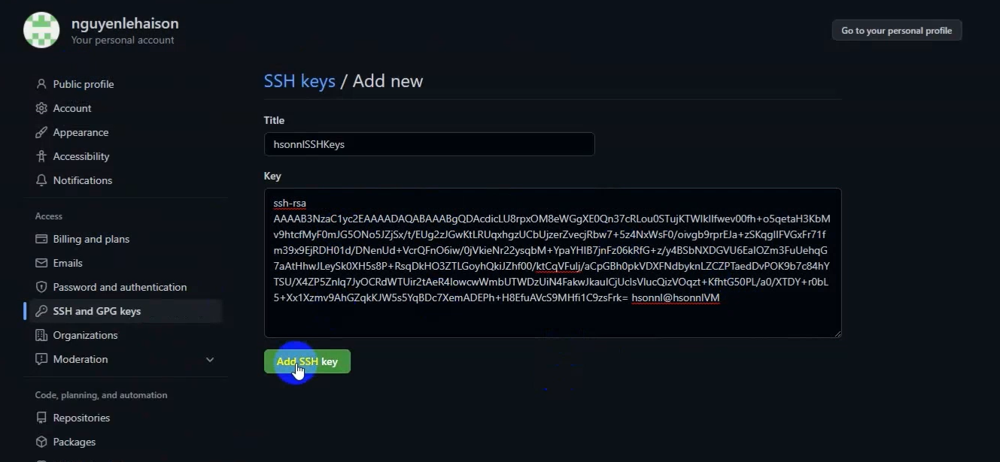
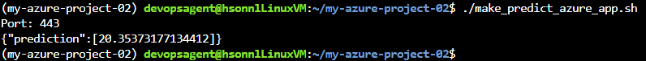

# HSONNL AZURE DEVOPS PROJECT 02
[](https://github.com/nguyenlehaison/my-azure-project-02/actions/workflows/python-app.yml)
[](https://dev.azure.com/nguyenlehaison/hsonnlProject/_build/latest?definitionId=10&branchName=master)
## Overview

1. In this project, you will build a Github repository from scratch and create a scaffolding that will assist you in performing both Continuous Integration and Continuous Delivery.
2. You'll use Github Actions along with a Makefile, requirements.txt and application code to perform an initial lint, test, and install cycle.
3. Next, you'll integrate this project with Azure Pipelines to enable Continuous Delivery to Azure App Service.

## Project Plan

- [Link to a Trello board for the project](https://trello.com/b/vqE9PNqV/azure-project-02)
- [Link to spreadsheet](https://docs.google.com/spreadsheets/d/1jUtjODDRa1M4Loy6gqyK2wgP7XGKRejWMXnr5Yq3gjU/edit?usp=sharing)
## Pre requisites
1. [An Azure Account](https://portal.azure.com/)
2. [A GitHub Account](http://github.com/)
3. [An Azure DevOps Account](https://dev.azure.com/)
## Architectural Diagram - CI - GitHub Actions
* Architectural Diagram (Shows how key parts of the system work)
# Let Get Started
## 1. Create Resource Group:
Create a resource group.
> NOTE: RG is using for the Web App and VM.
## 2. Create Virtual Machine:
We'll use Ubuntu Server 20.04 LTS - Gen2.

when creating, remember takenote: user, password,ip

after created, you can access to your VM by using CLI

```
ssh <user>@<VM public ip>
pass: <yourpassord>

```

After signed in, we will clone our project into VM by using SSH.
1. Create ssh key, and copy your public key

```bash
ssh-keygen -t rsa
cat ~/.ssh/id_rsa.pub

```
2. Switch to gitbub and add SSH key.

Add successful


3. Switch to CLI that accessed your VM, then clone project
```bash
git clone git@github.com:nguyenlehaison/my-azure-project-02.git
```
4. The project is cloned.


5. Run make all


## 3. Create App Service:
We'll use these setting:

| Name | _ |
| ------ | ------ |
| Resource Group | RG created on step 1 |
| Runtime | python3.7 |
| Region | Same as your RG |

## 4. Create PAT (Personel Access Token):
Navigate to https://dev.azure.com/{your_organization}/_usersSettings/tokens
,We'll chosing Full access option. Then create PAT.


> NOTE: Take note your PAT after created it.
## 5. Create Service connections:


> NOTE: Take note your Service connections Id (resourceId={serviceConnectionsId} on detail Service connections site)
## 6. Create Agent Pools:

| Name | Des |
| ------ | ------ |
| Azure Pipelines | Default pool created automatically |
| Default | Default pool created automatically |

| Type | Des | _ |
| ------ | ------ | ------ |
| Self-hosted | Using your VMs as its agents | Free but have manual error when building, so you need to config the env by access to your VM |
| Azure virtual machine scale set | Using Azure VM Scale set as its agents | Its not free, you need to fill the form to make it available or paid for it |

We'll create self-hosted pool
1. Create pools and take note poolName.
2. Navigate on your new pool, and observe the Agents Tab.
3. There are no agent exist, so we need to config the VM as Pool Agent.


Doing the following to config VM as Pool Agent. I using Ubuntu Server 20.04 LTS - Gen2.
```bash
# Download the agent
curl -O https://vstsagentpackage.azureedge.net/agent/2.202.1/vsts-agent-linux-x64-2.202.1.tar.gz

# Create the agent
mkdir myagent && cd myagent
tar zxvf ../vsts-agent-linux-x64-2.202.1.tar.gz

# Configure the agent
./config.sh
...
Enter server URL > https://dev.azure.com/<your organization>
Enter authentication type (press enter for PAT) > <your saved PAT>
...
2022-08-03 02:58:52Z: Settings Saved.

# Run the agent
./run.sh

```


After all, we navigate our new Agent Pool and observe the Agent Tab, Our Agent is running.
> Note: Take note your pool name and agent name.
## 7. Create Enviroments using to Deploy Web App:
Doing the following
1. Navigate to Environments by click on left side bar option.
2. New enviroment and take note your enviroment name.
3. To create Resource, you need to copy the Registration script and back to your VM
4. At your VM, paste the script to init the Environment.

5. When it already completed, back to our new enviroment, the resource is running here.


## 8. Create Pipeline:
We'll create pipeline to implement our CI/CD

using my ./azure-pipelines.yml and config as the following
```yml
variables:
  # Azure Resource Manager connection created during pipeline creation
  azureServiceConnectionId: 'your Service Connection Id'

  # Web app name
  webAppName: 'your web name'

  poolName: 'your pool name'
  # Agent VM image name
  vmImageName: 'your vm name'

  # Environment name
  environmentName: 'your environment name'

  # Project root folder. Point to the folder containing manage.py file.
  projectRoot: $(System.DefaultWorkingDirectory)

  # Python version: 3.7
  pythonVersion: '3.7'

```
Then click Save button, and Run pipeling, after all that, we will waiting for pipeline is running., it take about 8 - 20 minus


When its completed, navigate to your page and as you can see, the web app is running.


## 9. Make Prediction:
There is a file named make_predict_azure_app.sh be using to make your web app prediction.
Running the following below
```bash
# File Prediction
./make_predict_azure_app.sh

```
Result:


## 10. Testing with Locust:
There is a file named locust_run.sh be using to testing your web app with Locust.
Running the following below.
```bash
# Testing with Locust
./locust_run.sh

```
# Fix the Issues

### Achive zip error
```bash
sudo apt-get -y install zip

```

### VM is not already install data or build Python version error
```bash
# Update Ubuntu
sudo apt update && sudo apt upgrade

# Install the prerequisite for adding custom PPAs.
sudo apt install software-properties-common -y

# Add the deadsnakes/ppa to your APT package source list
sudo add-apt-repository ppa:deadsnakes/ppa -y

# APT update
sudo apt update

# Install Python 3.7
sudo apt install python3.7 -y

```

### Venv is not installed
```bash
# Install Virtualenv
sudo apt install python3.7-venv

```
# Enhancements

- Adding more test cases.
- Creating a UI for making predictions.
- Enhancements ML model.
- Setup app running on more environments.
# Demo 

<TODO: Add link Screencast on YouTube>


